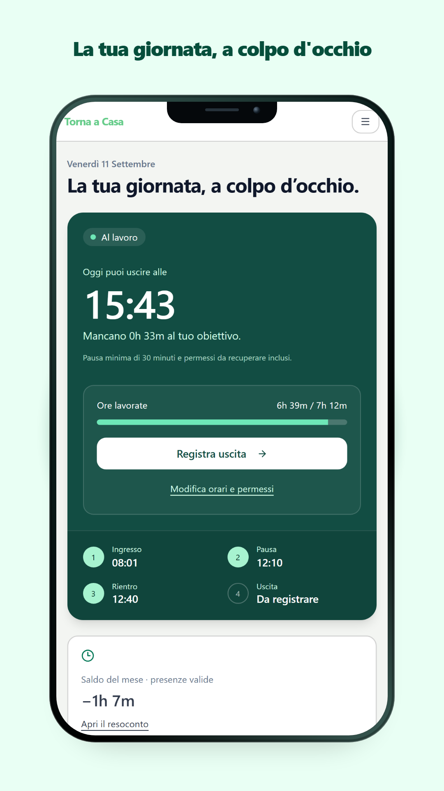
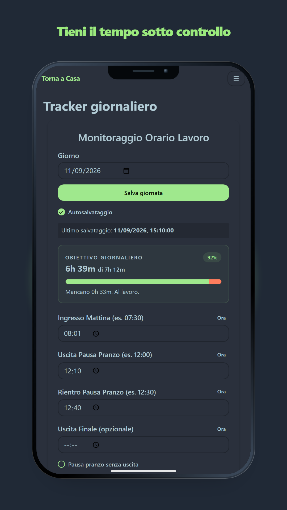
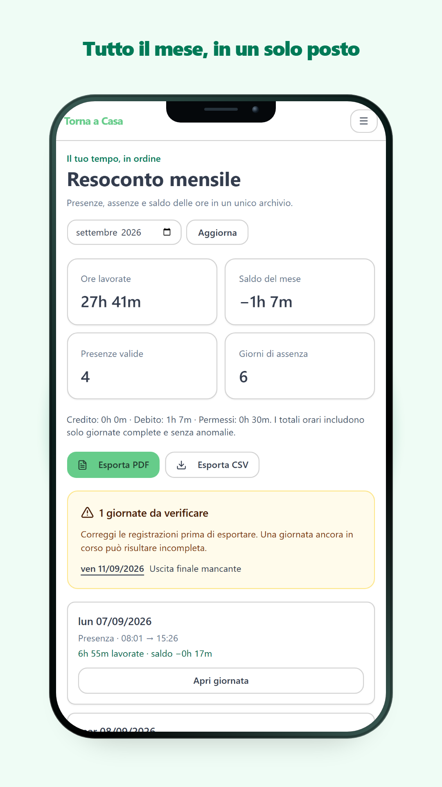
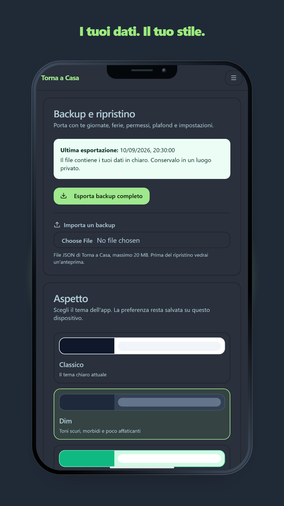

# Torna a Casa

> 🇬🇧 **Language:** English · [🇮🇹 Italiano](README.it.md)


[](https://ai-declaration.md)

**Torna a Casa** is an Android and web app for recording working hours. It is designed around the needs of Italian public-sector employees: record arrivals and departures, manage breaks, track leave and permits, review monthly balances, and keep data locally on the device.

## Features

- **Daily work tracking:** Record arrival, break, return, and departure times.
- **Live day overview:** See the estimated departure time, remaining time, daily progress, and monthly balance.
- **Break, leave, and permit management:** Record breaks and account for approved absences and permits.
- **Monthly archive and exports:** Review attendance, absences, and balances; export summaries as PDF or CSV.
- **Backup and restore:** Export a versioned JSON backup, validate it before importing, and choose whether to keep or replace existing records.
- **Local-first storage:** Data stays in the browser on the web and in SQLite on Android.
- **Themes:** Choose Classic, Dim, or Emerald.
- **Android and web:** Use the native Android app or the web version.

## Live demo

Try the web app on GitHub Pages: [razdnut.github.io/torna_a_casa](https://razdnut.github.io/torna_a_casa/).

## App screenshots

The following screenshots use demonstration data and are formatted for a 1080×1920 smartphone display.

### Your day at a glance



### Daily tracker



### Monthly archive and exports



### Backup and themes



## Working rules

The default rules are a 7-hour-12-minute target, a minimum 30-minute break, arrival from 07:30, departure by 19:00, and a break window from 12:00 to 15:00. Effective hours exclude breaks and permits; the balance compares effective hours against the target. Absences are counted Monday to Friday and public holidays are not currently included.

Incomplete days, inconsistent times, and overlapping records are highlighted in the monthly report. You can still export a report with anomalies: they are included in the export and the affected attendance records are excluded from working-hour totals.

## Technology stack

- **Frontend:** React and TypeScript
- **Styling:** Tailwind CSS and shadcn/ui
- **Icons:** Lucide React
- **Routing:** React Router
- **Mobile runtime:** Capacitor for Android
- **Local database:** Capacitor Community SQLite
- **Package manager:** pnpm

## Development

### Prerequisites

- [Node.js](https://nodejs.org/) 22.18+ or 24
- [pnpm](https://pnpm.io/) 9+

### Get started

```bash
git clone https://github.com/Razdnut/torna_a_casa.git
cd torna_a_casa
pnpm install
pnpm dev
```

The development server is normally available at `http://localhost:5173/`.

The main source code is in `src/`, with React components in `src/components/` and application pages in `src/pages/`.

### Checks

```sh
pnpm test
pnpm exec tsc -p tsconfig.app.json --noEmit
pnpm lint
pnpm build
pnpm exec cap sync android
```

Building Android requires JDK 21 and Android SDK 35. Browser checks should cover export and import, the overwrite choice during restore, reopening stored data, and the mobile layout.

## Build and release

### Web

```bash
pnpm build
pnpm preview
```

### Android APK

The **Android Release** GitHub Actions workflow builds and signs release APKs. Configure these repository secrets before creating a release:

- `ANDROID_KEYSTORE_BASE64`
- `ANDROID_KEYSTORE_PASSWORD`
- `ANDROID_KEY_ALIAS`
- `ANDROID_KEY_PASSWORD`

Create a tagged release with:

```bash
git tag v1.5.0
git push origin v1.5.0
```

You can also run the workflow manually from the repository’s **Actions** tab. The signed APK is attached to the GitHub Release and is also available as a workflow artifact.

## Docker

The published container image is `ghcr.io/razdnut/torna-a-casa`. Docker Compose uses image version `1.5.0` by default.

To select another published version, create a `.env` file in the project root:

```sh
TORNACASA_IMAGE_TAG=1.5.0
```

Start the app at `http://localhost:8080`:

```bash
docker compose up -d
```

Stop it with:

```bash
docker compose down
```

## Contributing

Contributions are welcome. Fork the repository, create a branch, and open a pull request. Please open an issue first for larger changes so the approach can be discussed.

## License

This project is licensed under the [GNU Affero General Public License v3.0](LICENSE) (`AGPL-3.0-only`).

---

<div align="left">

  

</div>
